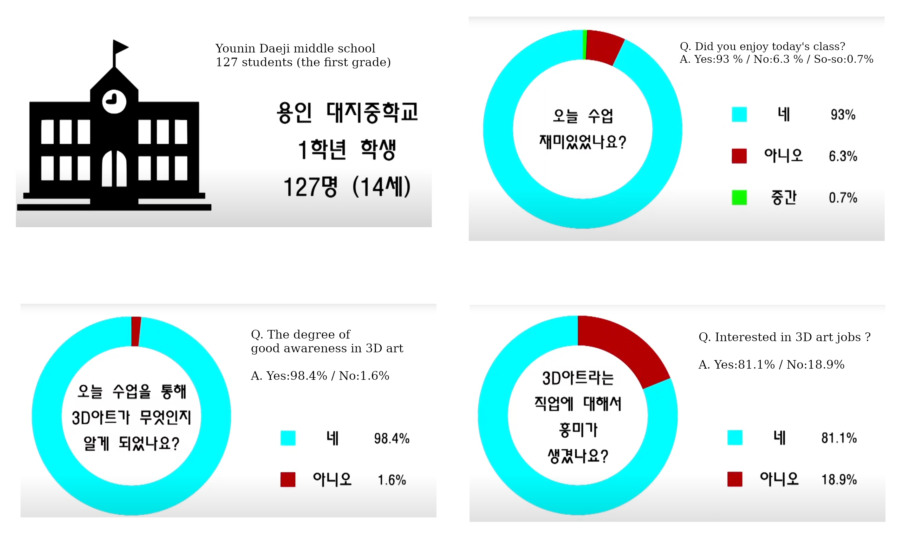

## Purpose
- Create simple cinematics and introduce our industry to middle school students

## Summary
This is my graduation work with my team.
There are three member including me. 
In this page, let me introduce our work(one poster and three video).
1. poster and story board.
2. final cinematic video
3. making film
4. presentation with middle school student and poll result which represent how students think. also we have time with other students.

---

## Software
zbrush, maya, substance painter, unfold3d, unreal and premiere.

---

## Final cinematic video
https://youtu.be/mjFMF0MhhIE
> <iframe width="750" height="505" src="https://www.youtube.com/embed/mjFMF0MhhIE?si=gXYAarB8b0GIMRVq" title="YouTube video player" frameborder="0" allow="accelerometer; autoplay; clipboard-write; encrypted-media; gyroscope; picture-in-picture; web-share" allowfullscreen></iframe>

---

## Making film video
https://youtu.be/s4fdAhl1GY0
> <iframe width="750" height="505" src="https://www.youtube.com/embed/s4fdAhl1GY0?si=e1wV_EAtW6APR3FQ" title="YouTube video player" frameborder="0" allow="accelerometer; autoplay; clipboard-write; encrypted-media; gyroscope; picture-in-picture; web-share" allowfullscreen></iframe>

---

## Class & Poll with middle students

---
