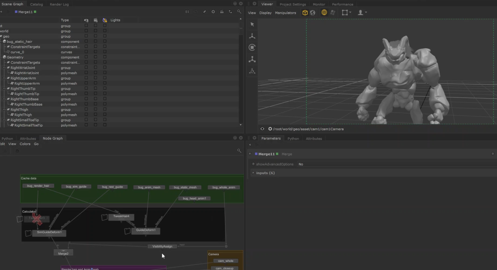

<!--  -->

## summary
- Category : Katana plugin
- Plugin list
  - TweakHair : tweak hair parameters (density / length / thickness / root thickness / tip thickness)
  - SimGuideDeform : deform static hair based on simulated guides
  - GuideDeform : deform static hair based on animated meshes

---

## Demonstration

> <iframe width="750" height="505" src="https://www.youtube.com/embed/KuFu3CsN1XI?si=Re3n1-9RRBcuYu23" title="YouTube video player" frameborder="0" allow="accelerometer; autoplay; clipboard-write; encrypted-media; gyroscope; picture-in-picture; web-share" referrerpolicy="strict-origin-when-cross-origin" allowfullscreen></iframe>
